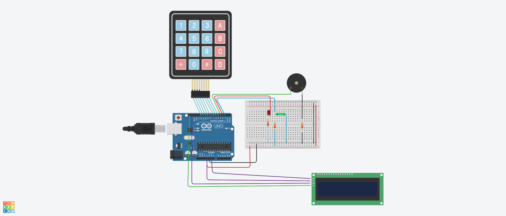
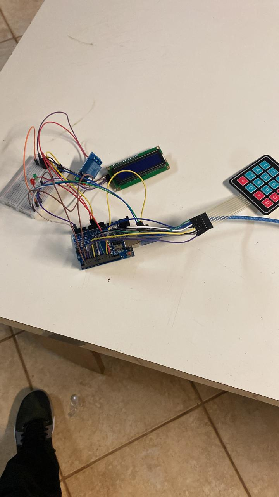

# Trabalho 2: Sistema de Alarme com Arduino

## 👥 Integrantes
- Arthur Andrade Carneiro Almeida
- Guilherme Rodrigues de Oliveira
- Kawan da Silva Costa

## 📝 Descrição do Projeto
Desenvolvimento de um sistema de alarme utilizando Arduino. O sistema conta com um teclado matricial 4x4 para criação e validação de senhas, um display LCD para comunicação com o usuário, um sensor magnético (Reed Switch / KY-021) para detectar a abertura da porta, LEDs de indicação de status e um relé acoplado a um sonalarme.

## 🛠️ Componentes Utilizados
- 1x Teclado Membrana Matricial 4x4 (16 Teclas)
- 1x Sonalarme SEM-12A-3/7V-C-C 3A 7V ATIVO
- 1x LED 5MM VD DIFUSO EVERLIGHT
- 2x Resistor 1W 220R
- 1x Protoboard BB-01 400P S/BASE TOWER++
- 1x Display LCD 16x2 C/ BL AZUL E I2C SOLDADO
- 1x Módulo Relé 1,5V
- 1x Módulo KY-021 SENSOR REED SWITCH
- 1x Arduino UNO

## Imagens do Projeto

Aqui estão os registros do circuito montado na Protoboard e no Simulador Wokwi.

---
## Links Úteis
* 'O código que do projeto original, é um tanto quanto diferente do código elaborado para o tinkercad, apesar de ter o mesmo funcionamento' https://dontpad.com/vejaaqui
* 'Tinkercad' https://www.tinkercad.com/things/76R4VsNHojb/editel?sharecode=fjB3OPc54GVeUrUuUawFrnU5R_1WLZWVh21bHwvP54I
[Nosso vídeo de apresentação do projeto] https://youtube.com/shorts/t2IV0UCI2mI
[Função troca de senha] https://youtube.com/shorts/nUzjnVxpFNs

## 📚 Bibliotecas Necessárias
* `Wire.h`: Permite a comunicação I2C entre o Arduino e o display LCD.
* `LCDIC2.h`: Controla o display LCD.
* `Keypad.h`: Responsável pela leitura do teclado matricial.

## ⚙️ Funcionamento (Máquina de Estados)
O código principal (`ProjetoArduino.ino`) foi estruturado utilizando o conceito de Máquina de Estados para controlar as etapas do sistema de alarme:

* **Estado 0:** O usuário cria a senha de 4 dígitos.
* **Estado 1:** Sistema desarmado e alarme desligado. O usuário pode pressionar `#` para iniciar o processo de armar o alarme ou digitar a senha de fábrica (`ABCD12`) para modificar a senha.
* **Estado 2:** Verificação da senha. Se correta, o LED verde acende e soa um bip, ativando o sistema. Caso contrário, o sistema volta ao estado de desarme.
* **Estado 3:** Sistema armado. O Arduino verifica constantemente o sensor magnético. Se a porta estiver fechada, exibe "Monitorando...". Se a porta for aberta, o LED vermelho acende e o sonalarme dispara (vai para o Estado 5).
* **Estado 4:** Desarmando o alarme (o usuário deve digitar a senha).
* **Estado 5:** Alarme disparado (Estado de emergência). O sonalarme toca ininterruptamente até que o usuário digite a senha correta.
